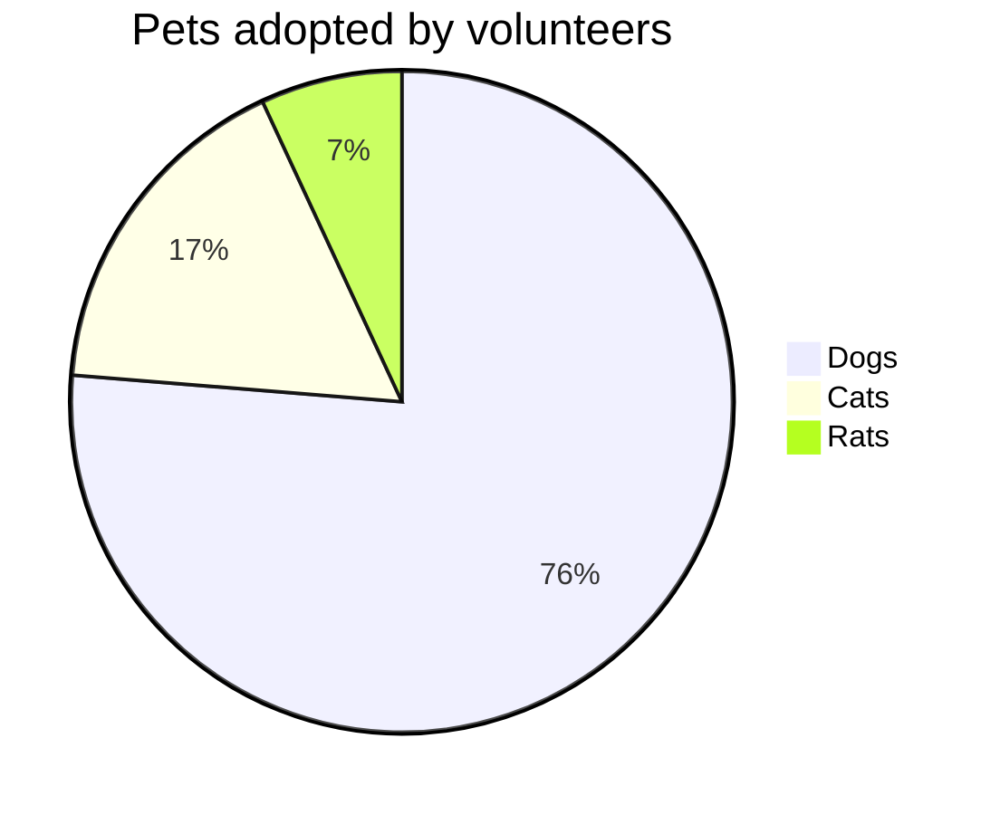

Documentation for toolbox
latest update: 8/23/2022

This is a testing page that we prepare to move all markdown files to this page as an official site of documentation.

Link test: [dao](dao/index.md)

Latex testing

equation mode:  
using double dollar sign
$$\sum^n_{i=0} x_i$$

in-text mode  $\sum^n_{i=0} x_i$

  flowchart  LR;
    Start-->|scenario,area| M1[Model I] 
    M1-->F1{feasible?}
    F1-->|no| End
    F1-->|yes| M2[Model II]
    M2-->M3[Model III]
    M3-->Complete

pie title Pets adopted by volunteers
  "Dogs" : 386
  "Cats" : 85
  "Rats" : 35

| Syntax      | Description |
| ----------- | ----------- |
| Header      | Title       |
| Paragraph   | Text        |
